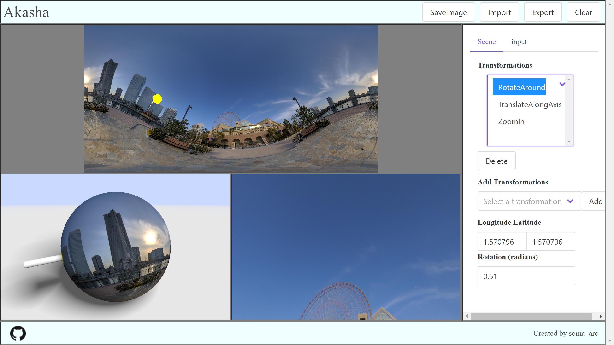

# Akasha


Spherical photo editor / viewer

## Build

``` shell
npm install -g webpack
npm install
npm run release
```

## Usage
Connect theta S in live mode
``` shell
npm run start
```
or access to the URL [https://soma-arc.net/Akasha/](https://soma-arc.net/Akasha/)

This system is tested on Google Chrome.
